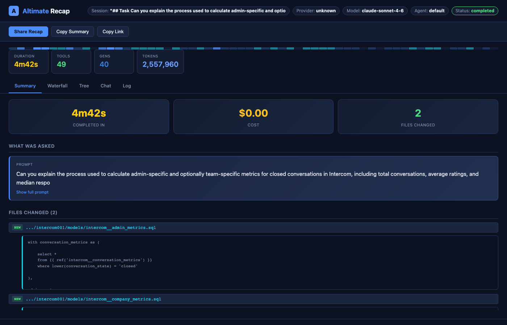
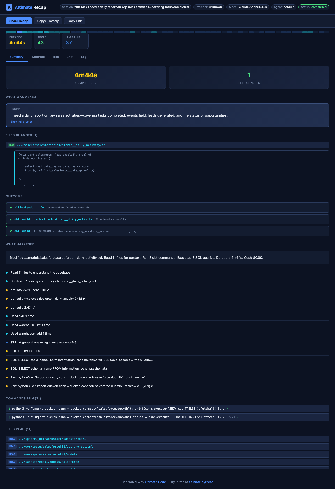

# Recap

Altimate Code captures detailed recaps of every session, including LLM generations, tool calls, token usage, cost, and timing, and saves them locally as JSON files. Recaps are invaluable for debugging agent behavior, optimizing cost, and understanding how the agent solves problems.

Recap is **enabled by default** and requires no configuration. Recaps are stored locally and never leave your machine unless you configure a remote exporter.



!!! note "Renamed from Tracer"
    The tracer feature has been renamed to **recap**. The `trace` command still works as a backward-compatible alias (`--no-trace` is the backward-compatible flag name). New features include loop detection, post-session summary, and shareable HTML exports.

## Quick Start

```bash
# Run a prompt (recap is saved automatically)
altimate-code run "optimize my most expensive queries"
# → Recap saved: ~/.local/share/altimate-code/traces/abc123.json

# List recent recaps
altimate-code recap list

# View a recap in the browser
altimate-code recap view abc123
```

## What's Captured

Each recap records the full agent session:

| Data | Description |
|------|-------------|
| **Generations** | Each LLM call with model, provider, finish reason, and variant |
| **Token usage** | Input, output, reasoning, cache read, and cache write tokens per generation |
| **Cost** | Per-generation and total session cost in USD |
| **Tool calls** | Every tool invocation with input, output, duration, and status |
| **Timing** | Start/end timestamps for every span (session, generation, tool) |
| **Errors** | Error messages and status on failed tool calls or generations |
| **Metadata** | Model, provider, agent, prompt, user ID, environment, tags |
| **Loop Detection** | Automatic detection of repeated tool call patterns |
| **Post-Session Summary** | AI-generated summary of the session's key actions and outcomes |

### Data Engineering Attributes

When using SQL and dbt tools, recaps automatically capture domain-specific data:

| Category | Examples |
|----------|----------|
| **Warehouse** | Bytes scanned/billed, execution time, queue time, partitions pruned, cache hits, query ID, estimated cost |
| **SQL** | Query text, dialect, validation results, lineage (input/output tables), schema changes |
| **dbt** | Command, model status, materialization, rows affected, compiled SQL, test results, Jinja errors |
| **Data Quality** | Row counts, null percentages, freshness, anomaly detection |
| **Cost Attribution** | LLM cost + warehouse compute cost + storage delta = total cost, per user/team/project |

These attributes are purely optional. Recaps are valid without them. They're populated automatically by tools that have access to warehouse metadata.

## Configuration

Add to your config file (`~/.config/altimate-code/altimate-code.json` or project-level `altimate-code.json`):

```json
{
  "tracing": {
    "enabled": true,
    "dir": "~/.local/share/altimate-code/traces/",
    "maxFiles": 100,
    "exporters": []
  }
}
```

| Option | Type | Default | Description |
|--------|------|---------|-------------|
| `enabled` | `boolean` | `true` | Enable or disable recap |
| `dir` | `string` | `~/.local/share/altimate-code/traces/` | Custom directory for recap files |
| `maxFiles` | `number` | `100` | Max recap files to keep (oldest pruned automatically). Set to `0` for unlimited |
| `exporters` | `array` | `[]` | Remote HTTP exporters (see below) |

### Disabling Recap

```json
{
  "tracing": {
    "enabled": false
  }
}
```

Or per-run with the `--no-trace` flag:

```bash
altimate-code run --no-trace "quick question"
```

## Viewing Recaps

### List Recaps

```bash
altimate-code recap list
```

Shows a table of recent recaps with session ID, timestamp, duration, tokens, cost, tool calls, and status.

```
SESSION              WHEN       DURATION   TOKENS     COST       TOOLS  STATUS     PROMPT
abc123def456         2m ago     45.2s      12,500     $0.0150    8      ok         optimize my most expensive queries
xyz789abc012         1h ago     12.8s      3,200      $0.0040    3      ok         explain this model
err456def789         3h ago     5.1s       1,800      $0.0020    2      error      run dbt tests
```

Options:

| Flag | Description |
|------|-------------|
| `-n`, `--limit` | Number of recaps to show (default: 20) |

### View a Recap

```bash
altimate-code recap view <session-id>
```

Opens a local web server with an interactive recap viewer in your browser.



The viewer has 5 tabs:

- **Summary** (default) — The story of the session: what was asked, files changed with diff previews, outcome (dbt/pytest/Airflow results), what happened timeline, and cost breakdown
- **Waterfall** — Gantt-style timeline bars for every span, color-coded by type
- **Tree** — Nested indentation view showing parent/child span relationships
- **Chat** — Conversation flow with user prompt and agent responses
- **Log** — Flat chronological list of all events

The Summary tab shows what matters most to data engineers:

- **What was asked** — Your prompt, truncated with expand toggle
- **Files changed** — Each file with NEW/EDIT badge and SQL diff preview
- **Outcome** — dbt build results, test results, SQL query results (clickable to jump to waterfall)
- **What happened** — Smart timeline grouping boring commands, showing meaningful actions
- **Loop warnings** — Automatic detection when the agent repeats the same tool call
- **Cost details** — Collapsible token breakdown with visual bar chart

Options:

| Flag | Description |
|------|-------------|
| `--port` | Port for the viewer server (default: random) |
| `--live` | Auto-refresh every 2s for in-progress sessions |

Partial session ID matching is supported. For example, `altimate-code recap view abc` matches `abc123def456`.

### Live Viewing (In-Progress Sessions)

Recaps are written incrementally. After every tool call and generation, a snapshot is flushed to disk. This means you can view a recap while the session is still running:

```bash
# In terminal 1: run a long task
altimate-code run "refactor the entire pipeline"

# In terminal 2: watch the recap live
altimate-code recap view <session-id> --live
```

The `--live` flag adds a green "LIVE" indicator and polls for updates every 2 seconds. The page auto-refreshes when new spans appear.

### From the TUI

Type `/recap` in the TUI to open a recap history dialog listing all recent sessions. Select any recap to open it in your browser with the interactive viewer. The current session appears at the top, and recaps are grouped by date with duration and timestamp info.

The viewer launches in live mode automatically for in-progress sessions, so you can watch spans appear as the agent works.

### Sharing Recaps

The recap viewer includes a **Share** button that exports a self-contained HTML file. This file includes all session data and can be opened in any browser without a server — perfect for sharing with teammates, attaching to tickets, or archiving sessions.

## Remote Exporters

Recaps can be sent to remote backends via HTTP POST. Each exporter receives the full recap JSON on session completion.

```json
{
  "tracing": {
    "exporters": [
      {
        "name": "my-backend",
        "endpoint": "https://api.example.com/v1/traces",
        "headers": {
          "Authorization": "Bearer <token>"
        }
      }
    ]
  }
}
```

| Field | Type | Description |
|-------|------|-------------|
| `name` | `string` | Identifier for this exporter (used in logs) |
| `endpoint` | `string` | HTTP endpoint to POST recap JSON to |
| `headers` | `object` | Custom headers (e.g., auth tokens) |

**How it works:**

- All exporters run concurrently with the local file write via `Promise.allSettled`
- A failing exporter never blocks local file storage or other exporters
- If the server responds with `{ "url": "..." }`, the URL is displayed to the user
- Exporters have a 10-second timeout
- All export operations are best-effort and never crash the CLI

## Recap File Format

Recaps are stored as JSON files in the traces directory. The schema is versioned for forward compatibility.

```json
{
  "version": 2,
  "traceId": "019cf4e2-...",
  "sessionId": "session-abc123",
  "startedAt": "2026-03-15T10:00:00.000Z",
  "endedAt": "2026-03-15T10:00:45.200Z",
  "metadata": {
    "model": "anthropic/claude-sonnet-4-20250514",
    "providerId": "anthropic",
    "agent": "builder",
    "variant": "high",
    "prompt": "optimize my most expensive queries",
    "userId": "user@example.com",
    "environment": "production",
    "version": "2.0.0",
    "tags": ["benchmark", "nightly"]
  },
  "spans": [
    {
      "spanId": "...",
      "parentSpanId": null,
      "name": "session-abc123",
      "kind": "session",
      "startTime": 1710500000000,
      "endTime": 1710500045200,
      "status": "ok"
    },
    {
      "spanId": "...",
      "parentSpanId": "<session-span-id>",
      "name": "generation-1",
      "kind": "generation",
      "startTime": 1710500000100,
      "endTime": 1710500003500,
      "status": "ok",
      "model": {
        "modelId": "anthropic/claude-sonnet-4-20250514",
        "providerId": "anthropic"
      },
      "finishReason": "stop",
      "cost": 0.005,
      "tokens": {
        "input": 1500,
        "output": 300,
        "reasoning": 100,
        "cacheRead": 200,
        "cacheWrite": 50,
        "total": 2150
      }
    },
    {
      "spanId": "...",
      "parentSpanId": "<generation-span-id>",
      "name": "sql_execute",
      "kind": "tool",
      "startTime": 1710500001000,
      "endTime": 1710500003000,
      "status": "ok",
      "tool": { "callId": "call-1", "durationMs": 2000 },
      "input": { "query": "SELECT ..." },
      "output": "10 rows returned",
      "attributes": {
        "de.warehouse.system": "snowflake",
        "de.warehouse.bytes_scanned": 45000000,
        "de.warehouse.estimated_cost_usd": 0.0012,
        "de.sql.validation.valid": true
      }
    }
  ],
  "summary": {
    "totalTokens": 2150,
    "totalCost": 0.005,
    "totalToolCalls": 1,
    "totalGenerations": 1,
    "duration": 45200,
    "status": "completed",
    "tokens": {
      "input": 1500,
      "output": 300,
      "reasoning": 100,
      "cacheRead": 200,
      "cacheWrite": 50
    }
  }
}
```

### Span Types

| Kind | Description | Key Fields |
|------|-------------|------------|
| `session` | Root span for the entire session | `input` (prompt), `output` (summary) |
| `generation` | One LLM call (step-start to step-finish) | `model`, `finishReason`, `tokens`, `cost` |
| `tool` | A tool invocation | `tool.callId`, `tool.durationMs`, `input`, `output` |

### Domain Attribute Namespaces

All domain-specific attributes use the `de.*` prefix and are stored in the `attributes` map on tool spans:

| Prefix | Domain |
|--------|--------|
| `de.warehouse.*` | Warehouse metrics (bytes, credits, partitions, timing) |
| `de.sql.*` | SQL quality (validation, lineage, schema changes) |
| `de.dbt.*` | dbt operations (model status, tests, Jinja, DAG) |
| `de.quality.*` | Data quality (row counts, freshness, anomalies) |
| `de.cost.*` | Cost attribution (LLM + warehouse + storage) |

## Crash Recovery

Recaps are designed to survive process crashes:

1. **Immediate snapshot.** A recap file is written as soon as the session starts, before any LLM interaction. Even if the process crashes immediately, a minimal recap file exists.

2. **Incremental snapshots.** After every tool call and generation completion, the recap file is updated atomically (write to temp file, then rename). The file on disk always contains a valid, complete JSON document.

3. **Crash handlers.** The `run` command registers `SIGINT`/`SIGTERM`/`beforeExit` handlers that flush the recap synchronously with a `"crashed"` status.

4. **Status indicators.** Recap status tells you exactly what happened:

| Status | Meaning |
|--------|---------|
| `completed` | Session finished normally |
| `error` | Session finished with an error |
| `running` | Session is still in progress (visible in live mode) |
| `crashed` | Process was interrupted before the session completed |

Crashed recaps contain all data up to the last successful snapshot. You can view them normally with `altimate-code recap view`.

## Historical Recaps

All recaps are stored in the traces directory and persist across sessions. Use `recap list` to browse history:

```bash
# Show the last 50 recaps
altimate-code recap list -n 50

# View any historical recap
altimate-code recap view <session-id>
```

Recaps are automatically pruned when `maxFiles` is exceeded (default: 100). The oldest recaps are removed first. Set `maxFiles: 0` for unlimited retention.

## Privacy

Recaps are stored **locally only** by default. They contain:

- The prompt you sent
- Tool inputs and outputs (SQL queries, file contents, command results)
- Model responses

If you configure remote exporters, recap data is sent to those endpoints. No recap data is included in the anonymous telemetry described in [Telemetry](../reference/telemetry.md).

!!! warning "Sensitive Data"
    Recaps may contain SQL queries, file paths, and command outputs from your session. If you share recap files or configure remote exporters, be aware that this data will be included.
