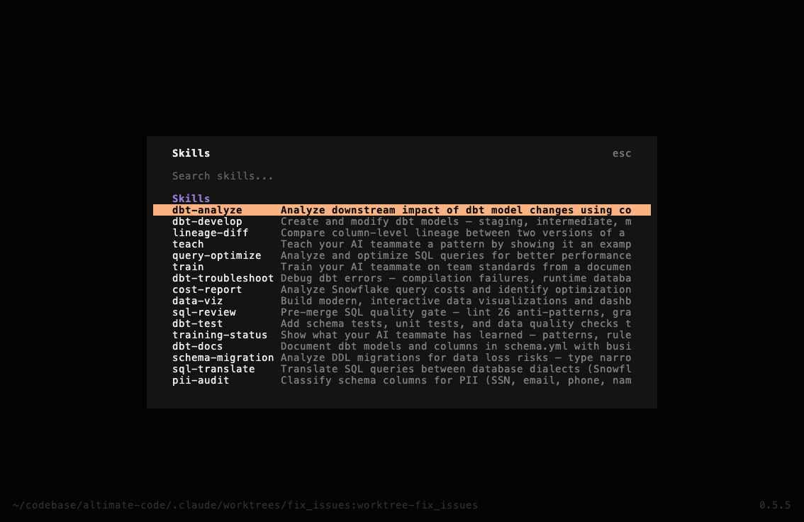
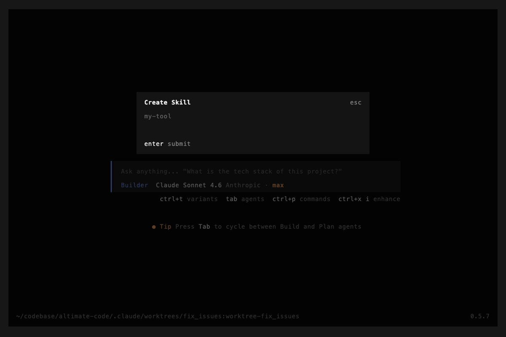
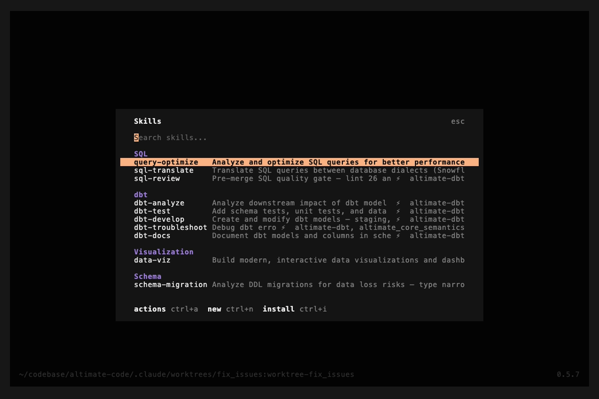

# Agent Skills

Skills are reusable prompt templates that extend agent capabilities.

## Skill Format

Skills are markdown files named `SKILL.md`:

```markdown
---
name: cost-review
description: Review SQL queries for cost optimization
---

Analyze the SQL query for cost optimization opportunities:

1. Check for full table scans
2. Evaluate partition pruning
3. Suggest clustering keys
4. Estimate credit impact
5. Recommend cheaper alternatives

Focus on the query: $ARGUMENTS
```

### Frontmatter Fields

| Field | Required | Description |
|-------|----------|-------------|
| `name` | Yes | Skill name |
| `description` | Yes | Short description shown in the agent's `<available_skills>` listing |
| `alwaysApply` | No | When `true`, the skill's full body is inlined into the system prompt at session start — the agent does not need to invoke the `Skill` tool to see it. See [Auto-loading skills](#auto-loading-skills). |
| `applyPaths` | No | A glob (string) or list of globs. When at least one file under the worktree matches, the skill's full body is inlined into the system prompt at session start. Useful for project-aware skills (e.g. `dbt_project.yml` for dbt projects). |

## Auto-loading skills

By default, skills are **lazy-loaded**: only the `name` and `description` appear in
the system prompt, and the full body is fetched only when the model invokes the
`Skill` tool. This keeps the prompt small but relies on the model choosing to
load the skill at the right moment.

For skills that should always be in context for a given kind of project (e.g.
"every dbt session should see the dbt-development pitfalls"), declare one of:

```yaml
---
name: dbt-develop
applyPaths:
  - "dbt_project.yml"        # matches if any dbt_project.yml exists in the worktree
  - "**/dbt_project.yml"
description: ...
---
```

or, for unconditional loading:

```yaml
---
name: house-rules
alwaysApply: true
description: ...
---
```

At session start, after the standard `<available_skills>` listing, every matched
skill body is appended to the system prompt under:

```
<auto_loaded_skill name="<skill-name>">
... full skill body ...
</auto_loaded_skill>
```

The agent is told it does not need to invoke the `Skill` tool again to access
these — they are binding guidance for the session.

### When to use

| Pattern | Mode |
|---|---|
| Project-type-specific guidance (dbt project, Snowflake project, BigQuery project) | `applyPaths` with the project marker file |
| Team conventions that apply to every session in a repo | `alwaysApply: true` in a project-level `.opencode/skills/<skill>/SKILL.md` |
| Skill that's only relevant when the user asks for it explicitly (e.g. test generation, cost review) | Leave both fields unset — keep lazy loading |

### Context-size implications

When a skill auto-loads, its full body lands in the system prompt. A 250-line
skill (~5K tokens) bumps the system prompt by roughly 25%. Two mitigators:

1. **Prompt caching amortizes the cost** — the system prompt is the most-cached
   part of the request. Across a long agent loop (~26 steps per task is typical)
   the auto-loaded body is read from cache, not re-billed as fresh input.
2. **Match the glob narrowly** — `applyPaths: "dbt_project.yml"` only fires
   inside dbt projects; non-dbt sessions are unaffected. The mechanism is
   opt-in per skill and per worktree.

If you find auto-loaded bodies are crowding out task-specific context, prefer
`applyPaths` over `alwaysApply` so the skill only loads when the project
markers indicate it's relevant.

## Discovery Paths

Skills are loaded from these locations (in priority order):

1. **Project directories** (project-scoped, highest priority):
    - `.opencode/skills/`
    - `.altimate-code/skill/`
    - `.altimate-code/skills/`

2. **Global user directories**:
    - `~/.altimate-code/skills/`

3. **Custom paths** (from config):

    ```json
    {
      "skills": {
        "paths": ["./my-skills", "~/shared-skills"]
      }
    }
    ```

4. **External directories & remote URLs** (if not disabled):
    - `~/.claude/skills/`
    - `~/.agents/skills/`
    - `.claude/skills/` (project, searched up tree)
    - `.agents/skills/` (project, searched up tree)

    ```json
    {
      "skills": {
        "urls": ["https://example.com/skills-registry.json"]
      }
    }
    ```

## Built-in Data Engineering Skills

altimate ships with built-in skills for common data engineering tasks. Type `/` in the TUI to browse what's available and get autocomplete on skill names.

| Skill | Description |
|-------|-------------|
| `/sql-review` | SQL quality gate that lints 26 anti-patterns, validates syntax, and checks safety |
| `/sql-translate` | Cross-dialect SQL translation |
| `/schema-migration` | Schema migration planning and execution |
| `/pii-audit` | PII detection and compliance audits |
| `/cost-report` | Snowflake FinOps analysis |
| `/lineage-diff` | Column-level lineage comparison |
| `/query-optimize` | Query optimization suggestions |
| `/data-viz` | Interactive data visualization and dashboards |
| `/dbt-develop` | dbt model development and scaffolding |
| `/dbt-test` | dbt schema test generation |
| `/dbt-unit-tests` | Automated dbt unit test generation (v1.8+) |
| `/dbt-docs` | dbt documentation generation |
| `/dbt-analyze` | dbt project analysis |
| `/dbt-troubleshoot` | dbt issue diagnosis |
| `/teach` | Teach patterns from example files |
| `/train` | Learn standards from documents/style guides |
| `/training-status` | Dashboard of all learned knowledge |

## CLI Commands

Manage skills from the command line:

```bash
# Browse skills
altimate-code skill list                    # table view
altimate-code skill list --json             # JSON (for scripting)
altimate-code skill show dbt-develop        # view full skill content

# Create
altimate-code skill create my-tool                    # scaffold skill + bash tool
altimate-code skill create my-tool --language python   # python tool stub
altimate-code skill create my-tool --language node     # node tool stub
altimate-code skill create my-tool --skill-only        # skill only, no CLI tool

# Validate
altimate-code skill test my-tool            # check frontmatter + tool --help

# Install from GitHub
altimate-code skill install owner/repo              # GitHub shorthand
altimate-code skill install https://github.com/...  # full URL (web URLs work too)
altimate-code skill install ./local-path            # local directory
altimate-code skill install owner/repo --global     # install globally

# Remove
altimate-code skill remove my-tool          # remove skill + paired tool
```

### TUI

Open the skill browser with `ctrl+i` when no other dialog is open, or type `/skills` in the prompt:



**Keyboard shortcuts:**

| Key | Action |
|-----|--------|
| `ctrl+i` | Open skill browser (when no dialog is open) / Install skill (when inside browser) |
| Enter | Use — inserts `/<skill-name>` into the prompt |
| `ctrl+a` | Actions — show, edit, test, or remove the selected skill |
| `ctrl+n` | New — scaffold a new skill + CLI tool |
| Esc | Back — returns to previous screen |

**Create skill** (`ctrl+n`):



**Install skill** (`ctrl+i` inside browser):



## Adding Custom Skills

The fastest way to create a custom skill is with the scaffolder:

```bash
altimate-code skill create freshness-check
```

This creates two files:

- `.opencode/skills/freshness-check/SKILL.md` — teaches the agent when and how to use your tool
- `.opencode/tools/freshness-check` — executable CLI tool stub

### Pairing Skills with CLI Tools

Skills become powerful when paired with CLI tools. Drop any executable into `.opencode/tools/` and it's automatically available on the agent's PATH:

```
.opencode/tools/           # Project-level tools (auto-discovered)
~/.config/altimate-code/tools/  # Global tools (shared across projects)
```

A skill references its paired CLI tool through bash code blocks:

```markdown
---
name: freshness-check
description: Check data freshness across tables
---

# Freshness Check

## CLI Reference
\`\`\`bash
freshness-check --table users --threshold 24h
freshness-check --all --report
\`\`\`

## Workflow
1. Ask the user which tables to check
2. Run `freshness-check` with appropriate flags
3. Interpret the output and suggest fixes
```

The tool can be written in any language (bash, Python, Node.js, etc.) — as long as it's executable.

### Skill-Only (No CLI Tool)

You can also create skills as plain prompt templates:

```markdown
---
name: cost-review
description: Review SQL queries for cost optimization
---

Analyze the SQL query for cost optimization opportunities.
Focus on: $ARGUMENTS
```

`$ARGUMENTS` is replaced with whatever the user types after the skill name (e.g., `/cost-review SELECT * FROM orders` passes `SELECT * FROM orders`).

### Skill Paths

Skills are loaded from these paths (highest priority first):

1. `.opencode/skills/` and `.altimate-code/skill/` (project)
2. `~/.altimate-code/skills/` (global)
3. Custom paths via config:

```json
{
  "skills": {
    "paths": ["./my-skills", "~/shared-skills"]
  }
}
```

### Remote Skills

Host skills at a URL and load them at startup:

```json
{
  "skills": {
    "urls": ["https://example.com/skills-registry.json"]
  }
}
```

## Disabling External Skills

```bash
export ALTIMATE_CLI_DISABLE_EXTERNAL_SKILLS=true
```

This disables skill discovery from `~/.claude/skills/` and `~/.agents/skills/` but keeps `.altimate-code/skill/` discovery active.

## Duplicate Handling

If multiple skills share the same name, project-level skills override global skills. A warning is logged when duplicates are found.
