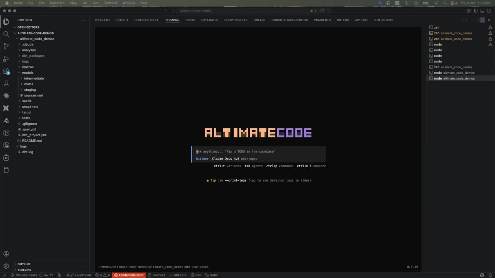
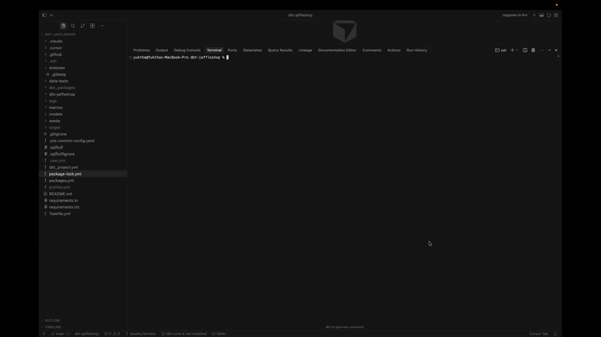
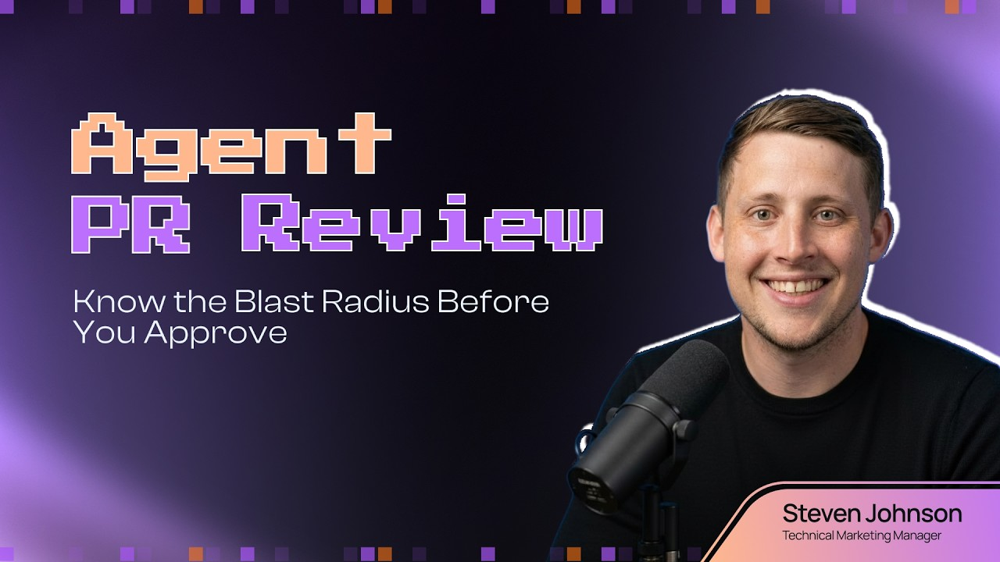
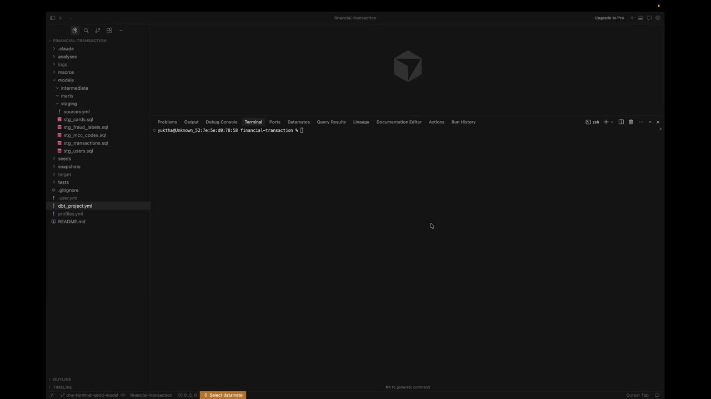
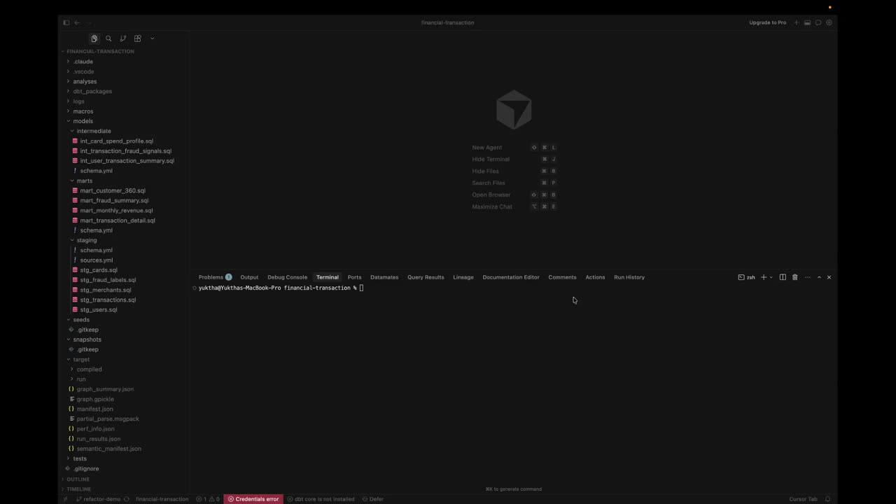
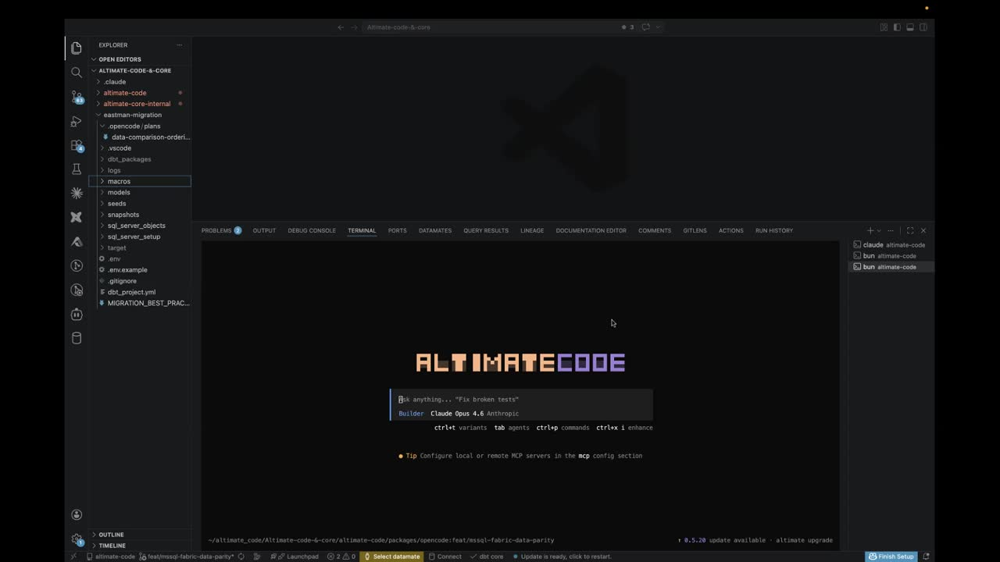
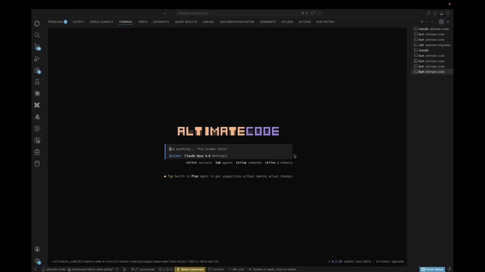

# Showcase

Real-world examples showing what altimate can do across data engineering workflows. Each example demonstrates end-to-end automation — from discovery to implementation.

---

## Onboarding a Junior Data Engineer — Automated Peer Review

`dbt` `SQL Quality` `A-F Grading`

A junior engineer always gets senior-level peer review — altimate grades the mart layer, flags every anti-pattern, fixes the offending SQL, and re-grades to prove the improvement.

**Prompt:**

> Run quality checks and grading on the mart layer queries of my dbt project to find out the SQL anti patterns. Also fix those issues, validate and re-grade them.

<small>*Click on the image to watch the demo.*</small>

---

## An Upstream Schema Changed. What Just Broke?

`dbt` `Lineage` `Incident Response`

A staging model renames a column and the dbt run fails. altimate reads the error log, traces lineage, pinpoints every broken downstream model, and fixes the references — no hunting through dozens of files.

**Prompt:**

> Switch to the `bug/column-rename` branch. A staging model was updated to rename a column, but downstream models weren't updated. Check the error log at `logs/dbt_run_error.log` and identify all the downstream models that broke. Fix them.

<small>*Click on the image to watch the demo.*</small>

---

## Column-Level Lineage Diff for PR Reviews

`dbt` `Column-Level Lineage` `PR Review`

Before approving a risky refactor PR, get a precise column-level lineage diff between the two branches — new dependencies, removed ones, source changes — so you know the blast radius before you merge.

**Prompt:**

> I am reviewing a PR that refactors `mart_patient_360` — the PR claims to fix a cartesian explosion, hash SSN for HIPAA, and add financial metrics. Before I approve, I need to understand exactly what changed at the column-level data flow. Run a column-level lineage diff between the old version (on `main`) and the new version (on `refactor/mart-patient-360-fix-cartesian-and-pii`) of `models/marts/mart_patient_360.sql`. Show me which column dependencies were added, removed, or changed source — I want to know the blast radius before merging.

<small>*Click on the image to watch the demo.*</small>

---

## From Idea to Production dbt Model in One Terminal Session

`dbt` `Model Scaffolding` `Tests & Docs`

A plain-English analytics request becomes a production-ready dbt asset — SQL, documentation, schema tests, validation — all in a single session.

**Prompt:**

> I need a new dbt model called `mart_monthly_revenue`. It should show monthly revenue broken down by merchant risk tier. Include total revenue, transaction count, unique merchants, and average transaction value. Use `stg_transactions` and `stg_merchants` as the upstream models.

<small>*Click on the image to watch the demo.*</small>

---

## Refactoring dbt Models Without Breaking Everything

`dbt` `Refactor` `Impact Analysis`

Plan a schema refactor with a complete blast-radius report before merging — every downstream model that needs a change, and exactly what change it needs.

**Prompt:**

> Switch to the `feat/refactor-stg-transactions` branch. The `stg_transactions` model renames `created_at` to `transaction_at` and drops `card_last_four` and `ip_address`. Before I merge this, tell me every downstream model that will break and what changes each one needs.

<small>*Click on the image to watch the demo.*</small>

---

## Migrating From MS SQL Server to MS Fabric via dbt

`MS SQL Server` `MS Fabric` `dbt` `Migration` `data-diff`

End-to-end warehouse migration: review the stored procedures, generate dbt models targeting Fabric, run cross-database data-diff validation, schema-difference checks, build the project, and produce an interactive migration validation dashboard.

**Prompt:**

> We need to perform MS SQL Server to MS Fabric migration via dbt. We have SQL Server code present at `sql_server_objects/stored_procedures` — review it and create dbt models for the same with Fabric as the target, following `migration_best_practices`. Raw layer tables are already populated in Fabric. Once done, perform compilation, cross-database `data_diff` validation between existing and new code, a schema-difference check, and then build the project in Fabric. Finally, produce an interactive migration validation dashboard with migration status, validation results, lineage, etc.

<small>*Click on the image to watch the demo.*</small>

---

## A Platform Admin's First Day With Microsoft Fabric

`MS Fabric` `Governance` `Lineage` `PII Audit`

Drop altimate into an unfamiliar Fabric instance and get an immediate picture — lineage, code quality, active roles, users, PII exposures — in one prompt.

**Prompt:**

> I am new to the Microsoft Fabric instance. Show me the lineage, code quality, active roles, users, PII exposures etc.

<small>*Click on the image to watch the demo.*</small>

---

## NYC Taxi Coverage Dashboard

`DuckDB` `dbt` `Airflow` `Python`

**Prompt:**

> Take the New York City taxi cab public dataset, bring up a DuckDB instance, and build a dashboard showing areas of maximum coverage and lowest coverage. Set up a complete dbt project with staging, intermediate, and mart layers, and create an Airflow DAG to orchestrate the pipeline.

---

## Olist E-Commerce Analytics Pipeline

`Snowflake` `Azure Data Factory` `Azure Blob Storage` `dbt`

**Prompt:**

> Build an end-to-end e-commerce analytics pipeline using the Olist Brazilian E-Commerce dataset. Use Azure Data Factory to ingest CSV files from Blob Storage into Snowflake raw tables, then orchestrate Snowflake stored procedures to transform data through raw → staging → mart layers (star schema with customer, product, seller dimensions and orders fact table). Create mart views for customer lifetime value, seller performance scores, and delivery SLA compliance.

---

## Global CO2 & Climate Explorer

`DuckDB-WASM` `SQL` `Browser`

**Prompt:**

> Build me an interactive Global CO2 & Climate Explorer dashboard using DuckDB-WASM running entirely in the browser, sourcing data from Our World in Data's CO2 dataset. Give me surprising insights about who emits the most, how that's changing, the equity angle of per-capita emissions, and which countries bear the most historical responsibility. Include an interactive SQL console with example queries showing off CTEs, window functions (LAG, RANK, SUM OVER), and make it a single index.html with a dark theme.

---

## Spotify Analytics Pipeline Migration

`PySpark` `dbt` `Databricks` `Airflow`

**Prompt:**

> Modernize my Spotify analytics pipeline: use the Kaggle Spotify Tracks public dataset, migrate all PySpark transformations in /spotify-analytics/ to dbt on Databricks/Spark, preserve the ML feature engineering logic (popularity tiers, mood classification, audio profile scores), add schema tests and unit tests, generate an Airflow DAG with SLAs and alerting, and validate semantic equivalence of the outputs.

---

## US Home Sales Data Science Dashboard

`Data Science` `K-Means` `OLS Regression` `R/ggplot2 Aesthetic`

**Prompt:**

> Download all available public US home sales data sets. Process and merge them into a unified format. Perform advanced data science on it to bring to the surface interesting insights. K-means, OLS regressions, and more. Build a single interactive dashboard with data science style charts, think violin plots, Q-Q plots and lollipop charts. Use a R/ggplot2 aesthetic. No BI style charts.

---

## Snowflake vs Databricks Deployment Benchmark

`Snowflake` `Databricks` `Benchmarking` `Cost Analysis`

**Prompt:**

> The NovaMart e-commerce analytics platform in the current directory is ready for deployment. Deploy to both Snowflake and Databricks, testing multiple warehouse sizes on each platform (Snowflake: X-Small, Small, Medium; Databricks: 2X-Small, Small, Medium SQL Warehouses) to find the optimal price-performance configuration. Run the full data pipeline and benchmark queries (CLV calculation, daily incremental, executive dashboard) on each warehouse size, capturing execution time, credits/DBUs consumed, and bytes scanned. Generate a cost analysis document with a recommendation matrix showing cost-per-run for each platform/size combination, and recommend the single best platform + warehouse size for production based on cost efficiency and performance.

